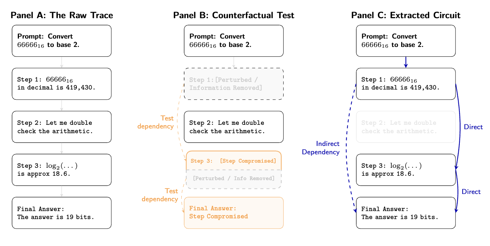
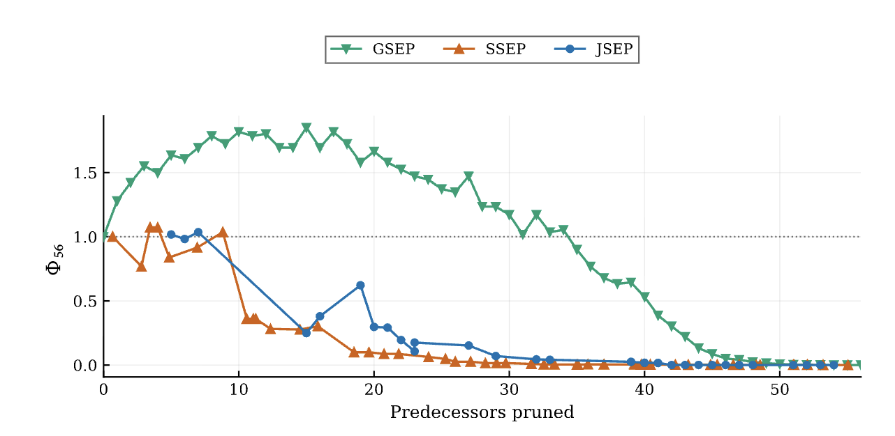
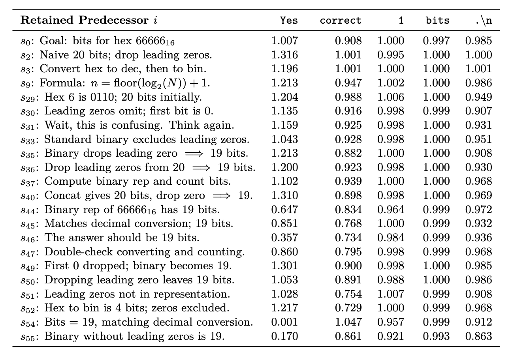

# Thought Circuits

*April 2026*

> **Note:** This was my first attempt at research. I tried to automate causal analysis of model reasoning before I had manually explored enough examples to understand which methods were informative, where they failed, or whether teacher-forced analysis was promising. My follow-up work takes a more exploratory, trace-by-trace approach: [new repository](https://github.com/MateoMarthoz/cot_investigations).

Research code from my final-year dissertation, **Step-Level Causal Circuits in Reasoning-Model Chains of Thought**.

The project asks a simple question:

> **How much can the predecessor set of a reasoning step be compressed while preserving the model's support for that step?**

Given a recorded chain of thought split into reasoning steps $s_0, s_1, \ldots, s_T$, each later step can be treated as a target. The aim is to remove as many earlier steps as possible while keeping the probability of the recorded target close to its clean value under teacher forcing.

Repeating this across a trace produces a sparse predecessor graph. An edge $s_i \rightarrow s_j$ means that predecessor $s_i$ survived the pruning procedure for target $s_j$ under a particular intervention, metric, and threshold.

The project builds on teacher-forced intervention ideas used in prior work such as [Thought Anchors](https://github.com/interp-reasoning/thought-anchors), but focuses on a different problem: **compressing each step's predecessor set and analysing the resulting structure across a complete reasoning trace**.

## Predecessor compression

For a target step $s_j$, the initial candidate set contains every earlier reasoning step:

$$
P_j = \{s_0, s_1, \ldots, s_{j-1}\}.
$$

A pruning procedure progressively removes predecessors and measures how much the model's support for the recorded target changes.

Conceptually, the objective is:

> **remove as much preceding context as possible while preserving the target step.**

The dissertation explores several ways of carrying out this search:

- **GSEP** greedily removes the least damaging predecessor at each round;
- **SSEP** learns a sparse predecessor mask independently for each target;
- **JSEP** jointly learns a matrix of step-to-step gates across the trace;
- **GSNP** applies a related idea at the level of whole reasoning steps.

The intervention determines how access to a predecessor is altered. The pruning algorithm determines which predecessors can be discarded while keeping the chosen target metric high.

## Experimental setting

The main experiments use **DeepSeek-R1-Distill-Qwen-14B** on a 57-step arithmetic and base-conversion reasoning trace.

The repository includes:

- the recorded reasoning trace;
- five aligned perturbation variants;
- five resampled variants;
- exact character- and token-level step alignment;
- attention-suppression and key-value intervention code;
- target-step probability metrics;
- greedy edge and node pruning;
- differentiable sparse-gating methods;
- token-level analysis of the retained predecessor set.

The trace is deliberately small enough to inspect in detail. The full step-level graph contains 1,596 possible directed predecessor edges.

## Interventions and measurement

The analysis holds the observed continuation fixed and scores it under teacher forcing after an intervention to earlier context.

This makes it possible to ask questions about the specific recorded trace without introducing variation from newly sampled continuations.

### Attention suppression

Later tokens are prevented from attending to selected source-step token positions.

Implementation:

`causal_cot/interventions/attention_suppression.py`

### Text perturbation and resampling

Selected source steps are replaced with aligned alternative text while later recorded steps remain the scoring target.

Relevant code:

- `causal_cot/perturbations/mlm.py`
- `experiments/run_perturb.py`
- `experiments/run_resample.py`

### Key-value perturbation

Clean and perturbed traces are run in parallel. Keys and values at selected source positions from the perturbed branch are substituted into the clean branch, while the target tokens being scored remain those from the recorded trace.

Implementation:

`causal_cot/interventions/kv_perturbation.py`

## Metrics

The main measurements track how an intervention changes the probability assigned to the observed target step.

The repository implements:

- per-step cross-entropy;
- relative perplexity;
- summed target-step log probability;
- a baseline-normalised joint probability score.

The normalised score used in several dissertation experiments is:

$$
\Phi_j(S)
= \frac{
p_j^{\mathrm{intervened}}(S) - p_j^{\mathrm{base}}
}{
p_j^{\mathrm{clean}} - p_j^{\mathrm{base}}
}.
$$

Here, $\Phi_j = 1$ corresponds to the clean target probability, while $\Phi_j = 0$ corresponds to the prompt-only baseline.

Implementation:

- `causal_cot/metrics.py`
- `causal_cot/joint_token_likelihood.py`

A code-faithful description of the measurement machinery is available in [`docs/methods.md`](docs/methods.md).

## Pruning methods

### GSEP: Greedy Step Edge Pruning

GSEP processes each target step separately.

At each pruning round it evaluates every currently retained predecessor, temporarily removes that predecessor in addition to those already pruned, and measures the resulting change in the target score. The least damaging predecessor is permanently removed.

This produces an ordered pruning trajectory for every target step.

Implementation:

`experiments/run_gsep.py`

### GSNP: Greedy Step Node Pruning

GSNP extends the same basic idea to whole reasoning steps.

A candidate step is evaluated by its effect on later surviving targets. The procedure greedily removes the candidate whose worst downstream effect is smallest.

Implementation:

`experiments/run_gsnp.py`

The combined node-then-edge procedure is implemented in:

`experiments/run_gsnp_gsep.py`

### SSEP: Single Step Edge Pruning

SSEP replaces discrete greedy search with differentiable sparse gates.

Each target step gets an independent set of learnable predecessor gates. The optimisation balances faithfulness to the clean target against a sparsity objective.

Implementation:

- `causal_cot/gradient/pruning_ssep.py`
- `experiments/gradient/train_ssep.py`

### JSEP: Joint Step Edge Pruning

JSEP learns a full upper-triangular matrix of step-to-step gates across the trace, optionally with node gates.

It attempts to optimise the step-level graph jointly in a single training procedure.

Implementation:

- `causal_cot/gradient/hooks_jsep.py`
- `experiments/gradient/train_jsep.py`

More detailed implementation notes are available in [`docs/PRUNING_METHODS_IMPLEMENTATION.md`](docs/PRUNING_METHODS_IMPLEMENTATION.md).

## Selected results

### How far can the final-step predecessor set be compressed?

The figure below compares the pruning trajectory of GSEP with the two differentiable alternatives on the final reasoning step.

The dotted line marks the clean-trace level, $\Phi_{56}=1$.

In this experiment, GSEP preserved the final-step metric much further into the pruning trajectory than SSEP or JSEP. The gradient-based methods degraded earlier, while the greedy method retained a relatively high score across a larger number of predecessor removals.

This comparison was performed on a single trace, and the gradient-based methods were evaluated using the dissertation training runs rather than a large multi-seed or hyperparameter study. It is therefore most useful as a comparison of the behaviour of the three search procedures in this setting.

## Token-level contribution profiles

A step-level score compresses an entire target continuation into one number. To see what the retained predecessor set was actually supporting, I also analysed the final step at token resolution.

For each retained predecessor, I measured the probability of selected target tokens after additionally intervening on that predecessor, relative to the same pruned context without that extra intervention.

Each row corresponds to a retained predecessor and each column to a selected token in the final reasoning step.

The effects are highly non-uniform. Some predecessors strongly affect tokens associated with commitment or evaluation, while leaving numerical tokens almost unchanged. Other predecessors have more noticeable effects on structural or concluding tokens.

This gives each retained predecessor a **token-level contribution profile**. It provides a more detailed view than a single step-to-step edge weight and suggests that useful causal information can live below the granularity of complete reasoning steps.

The analysis is still conditional on the intervention and pruning configuration used. The table should therefore be read as a sensitivity map for this particular trace, not as a unique decomposition of the model's internal reasoning.

## Retrospective interpretation

The original motivation was to transfer ideas from mechanistic circuit discovery to chain-of-thought reasoning. If a reasoning trace contains substantial redundancy, perhaps each step can be reduced to a small information set of predecessors that is sufficient to preserve it.

The results made me less confident that this picture transfers cleanly to natural-language reasoning steps.

In this trace, the predecessor structure remained relatively dense, and the interpretation of a retained edge depended on the intervention, scoring metric, and pruning procedure. A sentence-level graph can therefore hide a great deal of structure that only becomes visible when the target is analysed more finely.

I still think the broader teacher-forced intervention framework is useful. It provides a way to hold a recorded trace fixed, intervene on selected parts of its prior context, and inspect how support for later observed behaviour changes.

The "information set" experiments here are one example. The same framework could be extended in several directions:

- intervene on combinations of source steps;
- analyse selected target tokens instead of complete steps;
- inspect individual probability changes;
- compare the model's top-k alternatives before and after an intervention;
- use interventions chosen manually for a specific explanatory question instead of exhaustively filling a sentence-to-sentence matrix.

The token-level analysis in this repository is an early example of this more targeted style of analysis.

There are also methodological limits. Changing upstream context while forcing the original downstream trace can place the model in unusual states, and different intervention mechanisms can have different side effects. These measurements therefore benefit from comparison with other forms of model forensics.

One complementary approach is counterfactual resampling. Resampling allows the model to generate a new continuation after a change to the context, which gives a more natural downstream trajectory. It also answers a somewhat different question: what the model might do under a changed context, not necessarily what supported the behaviour that occurred in the recorded trace.

Combining teacher-forced interventions, targeted token-level measurements, and counterfactual resampling may provide a stronger basis for analysing the causal factors behind a particular model behaviour than relying on any one method alone.

## Repository structure

    causal_cot/
        gradient/             Differentiable SSEP/JSEP machinery
        interventions/        Attention suppression and KV perturbation
        perturbations/        MLM-based text perturbation
        joint_token_likelihood.py
        load_model.py
        metrics.py
        step_utils.py

    experiments/
        gradient/
            train_jsep.py
            train_ssep.py
        run_backward_ablation.py
        run_gsep.py
        run_gsnp.py
        run_gsnp_gsep.py
        run_joint_baselines.py
        run_perturb.py
        run_resample.py
        run_rollout.py

    data/
        rollout.txt
        perturbed/
        resampled/

    figures/
        schematic.png
        prune_comparison.png
        token_level.png

    docs/
        ATTRIBUTION.md
        PRUNING_METHODS_IMPLEMENTATION.md
        UPSTREAM_LICENSE_NOTICES.md
        methods.md

    requirements.txt

## Attribution

Small utilities in this project were copied or adapted from:

- [Thought Anchors](https://github.com/interp-reasoning/thought-anchors)
- [Edge-Pruning](https://github.com/princeton-nlp/Edge-Pruning)
